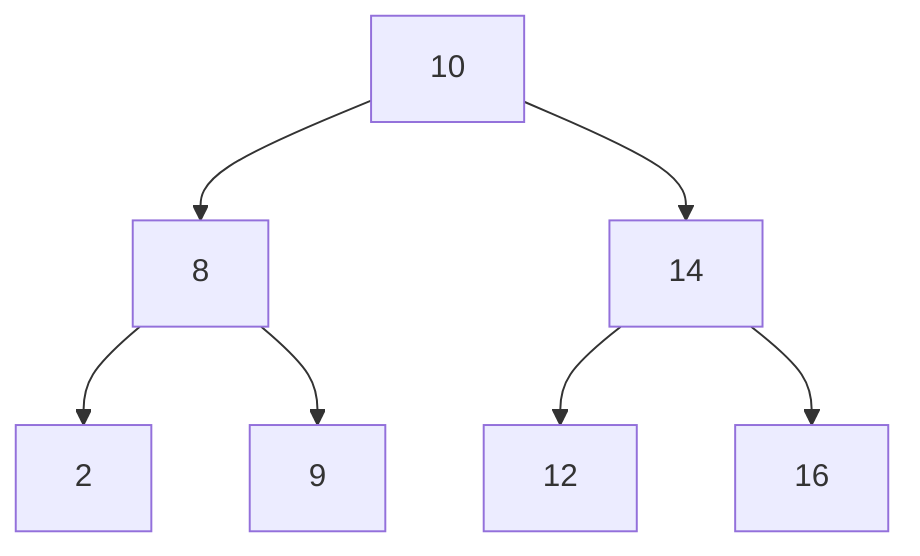
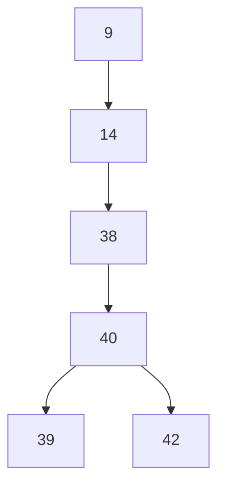

# VERİ YAPILARI ***Fırat Üniversitesi*** <sub>  </sub>
***
>BM veri yapıları dersi konuları & çıkmış soruları
# İçindekiler
<a name="içindekiler"></a>
1. Algoritmalar [Algoritmalar](#algoritmalar)
2. İkili Ağaçlar [Ağaçlar](#ağaçlar)

#

# Algoritmalar
[başa-dön](#içindekiler)
<a name="algoritmalar"></a>
1. Arama Algoritmaları [AramaAlgoritmaları](#arama)
2.  Sıralama Algoritmaları [SıralamaAlgoritmaları](#sıralı-arama)
#
### Arama Algoritmaları
<a name="arama"></a>
`Açıklama:` Arama algoritmaları, bir veri setindeki hedef elemanı bulmak için kullanılır.
* Doğrusal Arama (Linear Search) [dogrusalarama](#dogrusal-arama)
* İkili Arama (Binary Search) [ikiliarama](#ikili-arama)
#
### Doğrusal Arama Algoritması (Linear Search)
<a name="dogrusal-arama"></a>
* `Açıklama:` Lineer arama, her elemanı sırayla kontrol ederek aranan elemanı bulmaya çalışır.
  * `Best Case: O(1)` - Hedef elemanın dizinin başında olduğu durum.
  * `Worst Case: O(n)` - Hedef elemanın dizinin sonunda olduğu durum.
  * `Average Case: O(n)`
  * Nerelerde Kullanılır?
     - Küçük veri setlerinde ve sırasız verilerde kullanılabilir. Veri seti çok büyük değilse veya dizi sırasızsa tercih edilebilir. Örnek olarak, bir kitaplığın raflarında belirli bir kitabı aramak gibi.
     - İnternet tarayıcılar, web sayfasında metin ararken genellikle lineer arama algoritmasını kullanır.
     - [başa-dön](#içindekiler)
```java
public static int doğrusalArama(int[] dizi, int hedef) {
	        for (int i = 0; i < dizi.length; i++) {
	            if (dizi[i] == hedef) {
	                return i; // Hedef elemanın indeksini döndür
	            }
	        }
	        return -1; // Hedef elemanı dizide bulunamadı
	    }
```

<p align="center">
  <a href="https://www.youtube.com/watch?v=246V51AWwZM">
    
  </a>
</p>

#
### İkili Arama Algoritması (Binary Search)
<a name="ikili-arama"></a>
* `Açıklama:` İkili arama, sıralı bir dizide hedef elemanı bulmak için kullanılır. Her adımda diziyi ikiye bölerek aranan elemanı bulmaya çalışır. Bu sayede veriyi hızlı bir şekilde arama yapar. Ancak dizi sıralı olmalıdır ve bu nedenle önceden sıralama işlemi gerekebilir.
  * `Best Case: O(1)` - Hedef elemanın dizinin tam ortasında bulunması durumu.
  * `Worst Case:  O(log n)`- Tüm diziyi tarama gerektiren durum. (hedef elemanın başta veya sonda olması)
  * `Average Case:  O(log n)`  
  * Nerelerde Kullanılır?
     - büyük veritabanlarında veya indekslenmiş verilerde ikili arama daha yaygın olarak kullanılır.
  * 🔴 `NOT:` İkili arama, lineer aramaya göre genellikle daha hızlıdır. Ancak ikili arama için dizi sıralı olmalıdır, bu nedenle dizi sıralı ise tercih edilir. Lineer arama ise dizi sıralı ya da sırasız olsa da çalışabilir, ancak büyük veri setleri için daha yavaş olabilir.
  * [başa-dön](#içindekiler)
```java
 public static int ikiliArama(int[] dizi, int hedef) {
	        int sol = 0;
	        int sag = dizi.length - 1;

	        while (sol <= sag) {
	            int orta = sol + (sag - sol) / 2;

	            if (dizi[orta] == hedef) {
	                return orta; // Hedef elemanın indeksini döndür
	            } else if (dizi[orta] < hedef) {
	                sol = orta + 1; // Hedef eleman sağdaki yarıda
	            } else {
	                sag = orta - 1; // Hedef eleman soldaki yarıda
	            }
	        }

	        return -1; // Hedef elemanı dizide bulunamadı
	    }
```
<p align="center">
  <a href="https://www.youtube.com/watch?v=MFhxShGxHWc">
    
  </a>
</p>

<p align="center">
  <a href="https://www.youtube.com/watch?v=KXJSjte_OAI">
    
  </a>
</p>

#

### Sıralama Algoritmaları
<a name="sıralı-arama"></a>
`Açıklama:` Sıralama algoritmaları, bir veri setinin istenilen şekilde sıralanması için kullanılır.
* Baloncuk Sıralaması (Bubble Sort) [bubble](#bubble)
* Seçmeli Sıralama (Selection Sort) [selection](#selection)
* Ekleme Sıralaması (Insertion Sort) [insertion](#insertion)
* Hızlı Sıralama Algoritması (Quick Sort) [quick](#quick)
* Yığınlama Sıralaması (Heap Sort) [heap](#heap)
* Birleştirme Sıralaması (Merge Sort)  [merge](#merge)
* [başa-dön](#içindekiler)

#

### Baloncuk Sıralaması (Bubble Sort)
<a name="bubble"></a>
`Açıklama:` Baloncuk sıralaması, her adımda adışık elemanları karşılaştırıp, en büyük elemanı dizinin sonuna taşır. Bu işlem sıralamanın sonuna kadar iterasyonlarla sürdürülür.
#### Algoritma Adımları:

1. Dizinin başından başlayarak ardışık elemanları karşılaştır.
2. Eğer elemanlar sıralı değilse (küçükten büyüğe), yer değiştir.
3. Son elemana geldiğinde, en büyük eleman sona taşınmış olur.
4. diğer iterasyonda son elemanı dahil etmeden bir önceki elemana kadar aynı işlemleri tekrarla.
5. İterasyonlar dizinin sıralandığını gösterene kadar devam eder.
* `Best Case: O(n)` - Dizi zaten sıralıysa ve hiçbir yer değiştirme yapmaya gerek yoksa bu en iyi durumdur.
* `Worst Case: O(n^2)` - Dizi tersten sıralıysa (büyükten küçüğe) ve her adımda tüm elemanlar yer değiştirilirse bu en kötü durumdur.
* `Average Case: O(n^2)` - Ortalama durum da genellikle O(n^2) karmaşıklığına sahiptir.
*  Nerelerde Kullanılır?
     - küçük veri setlerinde kullanılabilir.
     - algoritma analizinde, en kötü durum senaryolarını test etmek için kullanılabilir.
      
* 🔴 `NOT:` Genel olarak, Bubble Sort verimlilik açısından daha iyi alternatifleri olduğu için gerçek dünya uygulamalarında sınırlı bir kullanıma sahiptir. Daha büyük veri setleri ve daha hızlı sıralama algoritmaları gerektiğinde Bubble Sort yerine diğer algoritmalar tercih edilir.
* [başa-dön](#içindekiler)

```java
public static void bubbleSort(int[] dizi) {
	        int n = dizi.length;
	        for (int i = 0; i < n - 1; i++) {
	            for (int j = 0; j < n - i - 1; j++) {
	                if (dizi[j] > dizi[j + 1]) {
	                    // Elemanları yer değiştir
	                    int temp = dizi[j];
	                    dizi[j] = dizi[j + 1];
	                    dizi[j + 1] = temp;
	                }
	            } }
```
<p align="center">
  <a href="https://www.youtube.com/watch?v=xli_FI7CuzA">
    
  </a>
</p>

#

### Seçmeli Sıralama (Selection Sort)
<a name="selection"></a>
`Açıklama:` Seçmeli sıralamanın temel fikri, veri setinden en küçük veya en büyük elemanı seçip sıralı olmayan bölüme yerleştirmek ve bu işlemi adım adım tekrarlayarak sıralı bir dizi oluşturmaktır.
#### Algoritma Adımları:

1. Başlangıçta sıralanmış bölüm boştur, sıralanmamış bölüm ise tam veri setidir.
2. Sıralanmamış bölüm içinden en küçük veya en büyük elemanı bulun (seçme adımı).
3. Seçilen elemanı sıralanmış bölüme taşıyın ve sıralanmamış bölümden çıkarın.
4. Adımları sıralanmamış bölümde kalan elemanlar bitene kadar tekrarlayın.
* `Best Case:O(n^2)` - Dizi her halükarda sıralanıp yeniden düzenlenidiği için her durumda aynı karmaşıklığa sahiptir.
* `Worst Case: O(n^2)` - Her adımda en küçük veya en büyük elemanı seçmek için tam bir tarama yapılması gerektiğinde.
* `Average Case: O(n^2)` - Ortalama durum da genellikle O(n^2) karmaşıklığına sahiptir.
*  Nerelerde Kullanılır?
     - küçük veri setlerinde kullanılabilir.
     - algoritma analizinde, en kötü durum senaryolarını test etmek için kullanılabilir.
     - daha verimli sıralama algoritmalarıyla karşılaştırma yapmak veya daha gelişmiş algoritmaların nasıl çalıştığını anlamak için kullanılabilir.
      
* 🔴 `NOT:` Genel olarak, gerçek dünya uygulamalarında Selection Sort'un kullanımı sınırlıdır. Daha büyük veri setleri ve daha hızlı sıralama algoritmaları gerektiğinde diğer algoritmalar tercih edilir.
* [başa-dön](#içindekiler)

```java
public static void selectionSort(int[] dizi) {
	                int n = dizi.length;
	                for (int i = 0; i < n - 1; i++) {
	                    int minIndex = i;
	                    for (int j = i + 1; j < n; j++) {
	                        if (dizi[j] < dizi[minIndex]) {
	                            minIndex = j;
	                        }
	                    }
	                    // En küçük elemanı swap işlemi ile taşı
	                    int temp = dizi[minIndex];
	                    dizi[minIndex] = dizi[i];
	                    dizi[i] = temp;
	                } }
```
<p align="center">
  <a href="https://www.youtube.com/watch?v=g-PGLbMth_g">
    
  </a>
</p>

# 

### Ekleme Sıralaması (Insertion Sort)
<a name="insertion"></a>
`Açıklama:` Ekleme sıralamasının temel fikri, sıralanmış bölüme eleman eklemek ve bu işlemi adım adım tekrarlayarak sıralı bir dizi oluşturmaktır.
#### Algoritma Adımları:

1. Başlangıçta sıralanmış bölümde tek bir eleman vardır (ilk eleman).
2. Sıralanmış bölümdeki elemanlardan daha küçük olan yeni bir elemanı alın.
3. Yeni elemanı, sıralanmış bölümdeki elemanlarla karşılaştırın ve yerine yerleştirin.
4. Yeni elemanı doğru pozisyona yerleştirdikten sonra, bu işlemi sıralanmış bölümdeki diğer elemanlarla tekrarlayın.
* `Best Case:O(n)` - Dizi zaten sıralıysa ve hiçbir yer değiştirme veya taşıma yapmadan geçilirse en iyi durumdur.
* `Worst Case: O(n^2)` - Dizi tersten sıralıysa ve her eleman eklendiğinde sıralanmış bölümün sonuna taşınması gerektiğinde.
* `Average Case: O(n^2)` - Ortalama durum da genellikle O(n^2) karmaşıklığına sahiptir.
*  Nerelerde Kullanılır?
     - küçük veri setlerinde kullanılabilir.
     - algoritma hatalarını ayıklama veya anlama amaçlı kullanılabilir.
     - diğer daha karmaşık sıralama algoritmalarının nasıl çalıştığını anlamak ve karşılaştırmak için bir başlangıç noktası olarak kullanılabilir.
      
* 🔴 `NOT:` Insertion Sort, nispeten küçük veri setleri veya nispeten sıralı verilerde kullanıldığında iyi bir performans gösterebilir. Ancak büyük veri setlerinde veya daha hızlı sıralama algoritmalarının tercih edilmesi gerektiğinde kullanımı sınırlıdır.
* [başa-dön](#içindekiler)

```java
public static void insertionSort(int[] dizi) {
	                    int n = dizi.length;
	                    for (int i = 1; i < n; i++) {
	                        int key = dizi[i];
	                        int j = i - 1;

	                        while (j >= 0 && dizi[j] > key) {
	                            dizi[j + 1] = dizi[j];
	                            j--;
	                        }
	                        dizi[j + 1] = key;
	                    }
	                }
```
<p align="center">
  <a href="https://https://www.youtube.com/watch?v=JU767SDMDvA">
    
  </a>
</p>

#
### Hızlı Sıralama (Quick Sort)
<a name="quick"></a>
`Açıklama:` hızlı ve etkili bir sıralama algoritmasıdır. Bu algoritma, sıralanacak veri setini bölüp parçalayarak çalışır (divide and conquer) . Her adımda bir "pivot" elemanı seçilir ve bu pivot elemanının solunda daha küçük, sağındaysa daha büyük elemanlar yer alacak şekilde bölünme işlemi yapılır. Bu bölünme işlemi sırasıyla rekürsif olarak devam eder ve sonuç olarak veri seti sıralanmış olur.

#### Algoritma Adımları:

1. Veri setinden bir pivot eleman seçilir. Pivot eleman, genellikle dizinin ortasından veya rastgele bir elemandan seçilir.
2. Pivot elemanın solunda, pivot elemandan daha küçük olan elemanlar; sağında, pivot elemandan daha büyük olan elemanlar olacak şekilde bölünme işlemi yapılır.
3. Sol ve sağ bölümler için aynı işlem (rekürsif adım) tekrar edilir.
4. Bölümler tek eleman veya boş bir dizi haline geldiğinde, bu bölümler sıralanmış kabul edilir.
5. Rekürsif adımlar tamamlandığında, veri seti sıralanmış olur.
* `Best Case:O(n log n)` - Pivot elemanın iyi seçildiği ve her adımda veri setini yaklaşık olarak iki eşit parçaya böldüğü durumda.
* `Worst Case: O(n^2)` - Pivot elemanın en kötü şekilde seçildiği durumda. Örneğin, her seferinde dizinin en küçük veya en büyük elemanı seçilirse.
* `Average Case:  O(n log n)` - Ortalama durumda genellikle O(n log n) karmaşıklığına sahiptir. Diğer sıralama algoritmalarına göre genellikle daha hızlıdır.
*  Nerelerde Kullanılır?
     - Veritabanlarındaki kayıtları sıralamak için kullanılabilir. Büyük miktardaki veriyi hızlı bir şekilde sıralamak önemli olabilir.
     - Büyük miktarda sayısal veriyi analiz etmek veya işlemek gerektiğinde kullanılabilir. Bilimsel uygulamalarda sıkça kullanılan bir algoritmadır.
     - Veri madenciliği ve büyük veri analizi alanlarında tercih edilebilir.
      
* 🔴 `NOT:` Genel olarak, Quick Sort büyük veri setlerini hızlı bir şekilde sıralamak istendiğinde veya veri sıralamasının gerektiği birçok uygulama alanında kullanılabilir. Daha hızlı sıralama algoritmaları olan Merge Sort veya Tim Sort gibi algoritmalarla da karşılaştırma yapmak faydalı olabilir.
* [başa-dön](#içindekiler)

```java
public static void quickSort(int[] dizi, int küçük, int büyük) {
	                    if (küçük < büyük) {
	                        int pivotIndex = bölünme(dizi, küçük, büyük);
	                        quickSort(dizi, küçük, pivotIndex - 1);
	                        quickSort(dizi, pivotIndex + 1, büyük);
	                    }
	                }

	                public static int bölünme(int[] dizi, int küçük, int büyük) {
	                    int pivot = dizi[büyük];
	                    int i = küçük - 1;

	                    for (int j = küçük; j < büyük; j++) {
	                        if (dizi[j] < pivot) {
	                            i++;
	                            int temp = dizi[i];
	                            dizi[i] = dizi[j];
	                            dizi[j] = temp;
	                        }
	                    }

	                    int temp = dizi[i + 1];
	                    dizi[i + 1] = dizi[büyük];
	                    dizi[büyük] = temp;

	                    return i + 1;
	                }
```
<p align="center">
  <a href="https://https://www.youtube.com/watch?v=Hoixgm4-P4M">
    
  </a>
</p>

# 

### Yığınlama Sıralaması (Heap Sort)
<a name="heap"></a>
`Açıklama:` Bu algoritma, bir "heap" veri yapısı kullanarak veri setini sıralar. Heap, özellikle en büyük veya en küçük elemanı hızla almak için optimize edilmiş bir ağaç yapısıdır.
#### Algoritma Adımları:

1. Veri seti önce bir "max heap" olarak düzenlenir. Max heap, her düğümün alt düğümlerinden daha büyük bir değeri olduğu bir ağaç yapısıdır.
2. En büyük eleman (kök) alınıp sondaki eleman ile yer değiştirilir ve sondaki eleman sıralanmış bölüme eklenir.
3. Max heap özelliği korunarak tekrar max heap yapısı oluşturulur.
4. İşlem sondan başa doğru tekrar edilir, tüm elemanlar sıralanmış bölüme eklenir.
* `Best Case: O(n log n)` - Heapify (max heap oluşturma) işlemi O(n) karmaşıklığına sahiptir ve bu işlem yalnızca bir kere yapılır.
* `Worst Case: O(n log n)` - Heapify işlemi her adımda O(log n) karmaşıklığına sahip olduğundan, toplam karmaşıklık O(n log n) olur.
* `Average Case: O(n log n)` - Ortalama durumda da genellikle O(n log n) karmaşıklığına sahiptir.
*  Nerelerde Kullanılır?
     - Büyük miktardaki veri setlerini analiz etmek veya sıralamak için Heap Sort kullanılabilir. İstatistik ve veri madenciliği uygulamalarında tercih edilebilir.
      
* 🔴 `NOT:` Genel olarak, Heap Sort büyük veri setlerini sıralamak veya öncelik kuyrukları oluşturmak gibi durumlarda tercih edilebilir. Daha verimli sıralama algoritmaları gibi Merge Sort veya Quick Sort gibi seçenekler de göz önünde bulundurulmalıdır.
* [başa-dön](#içindekiler)

```java
public static void heapSort(int[] dizi) {
	                    int n = dizi.length;

	                    // Max heap oluştur
	                    for (int i = n / 2 - 1; i >= 0; i--) {
	                        heapify(dizi, n, i);
	                    }

	                    // Heap'tan elemanları çıkararak sırala
	                    for (int i = n - 1; i > 0; i--) {
	                        int temp = dizi[0];
	                        dizi[0] = dizi[i];
	                        dizi[i] = temp;

	                        heapify(dizi, i, 0);
	                    }
	                }

	                public static void heapify(int[] dizi, int n, int i) {
	                    int largest = i;
	                    int left = 2 * i + 1;
	                    int right = 2 * i + 2;

	                    if (left < n && dizi[left] > dizi[largest]) {
	                        largest = left;
	                    }

	                    if (right < n && dizi[right] > dizi[largest]) {
	                        largest = right;
	                    }

	                    if (largest != i) {
	                        int swap = dizi[i];
	                        dizi[i] = dizi[largest];
	                        dizi[largest] = swap;

	                        heapify(dizi, n, largest);
	                    }
	                }
```
<p align="center">
  <a href="https://www.youtube.com/watch?v=2DmK_H7IdTo">
    
  </a>
</p>

#

### Birleştirme Sıralaması (Merge Sort)
<a name="merge"></a>
`Açıklama:` Merge Sort, veri setini bölerek sıralayan etkili bir sıralama algoritmasıdır. Veri setini önce küçük parçalara böler, sonra bu parçaları sıralayarak birleştirir. Merge Sort, özellikle büyük veri setleri üzerinde iyi bir performans gösterir.
#### Algoritma Adımları:

1. Veri seti ortadan ikiye bölünür.
2. Her iki parça için aynı işlem rekürsif olarak tekrarlanır.
3. Tekrar birleştirme (merge) işlemi yapılırken, sıralı parçalar birleştirilerek tek bir sıralı dizi oluşturulur.

* `Best Case: O(n log n)` - Bölme ve birleştirme işlemleri her adımda O(n) karmaşıklığına sahip olduğundan, en iyi durumda O(n log n) karmaşıklığı elde edilir.
* `Worst Case: O(n log n)` -En kötü durumda da genellikle O(n log n) karmaşıklığına sahiptir.
* `Average Case: O(n log n)` - Ortalama durumda da genellikle O(n log n) karmaşıklığına sahiptir.
*  Nerelerde Kullanılır?
     - Bellek boyutları yetersiz olduğunda veya veri belleğine sığmayan büyük veri setleri üzerinde sıralama yapmak gerektiğinde Merge Sort kullanılabilir.
      
* 🔴 `NOT:` Genel olarak, Merge Sort büyük veri setleri üzerinde sıralama gerektiğinde veya stabil bir sıralama algoritması kullanılması gerektiğinde tercih edilebilir. Diğer hızlı sıralama algoritmaları gibi Quick Sort veya Heap Sort da göz önünde bulundurulabilir.
* [başa-dön](#içindekiler)

```java
public static void mergeSort(int[] arr, int left, int right) {
        if (left < right) {
            int mid = (left + right) / 2;

            mergeSort(arr, left, mid);
            mergeSort(arr, mid + 1, right);

            merge(arr, left, mid, right);
        }
    }

    public static void merge(int[] arr, int left, int mid, int right) {
        int n1 = mid - left + 1;
        int n2 = right - mid;

        int[] leftArr = new int[n1];
        int[] rightArr = new int[n2];

        for (int i = 0; i < n1; i++) {
            leftArr[i] = arr[left + i];
        }
        for (int j = 0; j < n2; j++) {
            rightArr[j] = arr[mid + 1 + j];
        }

        int i = 0, j = 0, k = left;
        while (i < n1 && j < n2) {
            if (leftArr[i] <= rightArr[j]) {
                arr[k] = leftArr[i];
                i++;
            } else {
                arr[k] = rightArr[j];
                j++;
            }
            k++;
        }

        while (i < n1) {
            arr[k] = leftArr[i];
            i++;
            k++;
        }

        while (j < n2) {
            arr[k] = rightArr[j];
            j++;
            k++;
        }
    }
```
<p align="center">
  <a href="https://www.youtube.com/watch?v=4VqmGXwpLqc">
    
  </a>
</p>

#

# İkili Ağaçlar (Binary Search Tree)
<a name="ağaçlar"></a>
* İkili arama ağacında bir düğümün en fazla iki tane çoçuğu vardır ve alt/çocuk bağlantıları belirli bir sıraya göre yapılır. Küçük veya alfabetik olarak önce olanlar sola, büyük veya eşit olanlar sağ tarafa bağlanır.
* Dengeli ikili ağaç üzerinde arama yapmanın karmaşıklığı `O(log₂[n])`, dengesiz bir ikili ağaç üzerinde ise (bağlantılı listeye kaymıştır) `O(n)` ' e doğru kayar.
  
Basit Bir Dengeli İkili Ağaç Modeli:

Basit Bir Dengesiz İkili Ağaç Modeli:

[başa-dön](#içindekiler)
## İkili Ağaç için Düğüm oluşturma
* İkili ağaçta bir düğüme ait veri yapısında dataya ek olarak iki tane işaretçi bulunur; biri sol diğeri sağ olarak adlandırılan bu işaretçiler düğümlerin çoçuklarını bağlamak içindir.
```java
public class Node {
int data;
Node left;
Node right;

public Node(int data) {
	this.data = data;
	left = null;
	right = null;
}
```
[başa-dön](#içindekiler)
## İkili Ağaça düğüm ekleme
```java
public class Agac {
 Node root;

public Agac() {
root = null;
}

Node newNode(int data) {
	root = new Node(data);
	return root;
}

Node insert(Node root, int data) {
	if(root != null) {
		if(data<root.data) 
			root.left = insert(root.left,data);
		else 
			root.right = insert(root.right,data);
	}else {
		root = newNode(data);
	}
	return root;
} }
```
[başa-dön](#içindekiler)
## İkili Ağaç üzerinde dolaşma & düğümlere erişim 
1. Preorder -->   KÖK, SOL TARAF, SAĞ TARAF
2. Inorder -->    SOL TARAF, KÖK, SAĞ TARAF
3. Postorder -->  SOL TARAF, SAĞ TARAF, KÖK

## Preorder dolaşma
```java
void preOrder(Node root) {
	if(root != null) {
		System.out.print(root.data + " ");
		preOrder(root.left);
		preOrder(root.right);
	}
}
```

## Inorder dolaşma
```java
void inOrder(Node root) {
	if(root != null) {
		inOrder(root.left);
		System.out.print(root.data + " ");
		inOrder(root.right);
	}
}
```

## Postorder dolaşma
```java
void postOrder(Node root) {
	if(root != null) {
		postOrder(root.left);
		postOrder(root.right);
		System.out.print(root.data + " ");
	}
}
```
[başa-dön](#içindekiler)
## İkili Ağaç üzerinde düğüm silme
```java
// Verilen değeri ağaçtan silen fonksiyon
Node deleteNode(Node root, int key) {
    // Temel durum: Ağaç boşsa veya istenen düğüm null ise
    if (root == null)
        return root;

    // İstenen değer, sol alt ağaçta ise sol tarafa git
    if (key < root.data)
        root.left = deleteNode(root.left, key);
    // İstenen değer, sağ alt ağaçta ise sağ tarafa git
    else if (key > root.data)
        root.right = deleteNode(root.right, key);
    // Eğer değer bulunduysa
    else {
        // Sadece bir çocuğu veya hiç çocuğu olmayan durumda düğümü sil
        if (root.left == null)
            return root.right;
        else if (root.right == null)
            return root.left;

        // İki çocuğu olan durumda, inorder halefini bul
        root.data = minValue(root.right);

        // Inorder halefi olan düğümü sil
        root.right = deleteNode(root.right, root.data);
    }

    return root;
}

// Verilen ağacın en küçük değerini bulan yardımcı fonksiyon
int minValue(Node root) {
    int minValue = root.data;
    while (root.left != null) {
        minValue = root.left.data;
        root = root.left;
    }
    return minValue;
}
```
[başa-dön](#içindekiler)
## İkili Ağaç boyut & yükseklik bulma
```java
int height(Node root) {
	if(root == null) {
		return -1;
	}else {
		int  sol=0; int sag=0;
		sol = height(root.left);
		sag = height(root.right);
		if(sol>sag) {
			return sol+1;
		}else {
			return sag+1;
		}
	}
}

int size(Node root) {
	if(root==null) {
		return 0;
	}else {
		return size(root.left) + 1 + size(root.right);
	}
}
```
